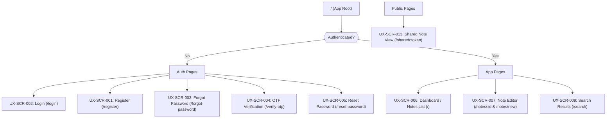
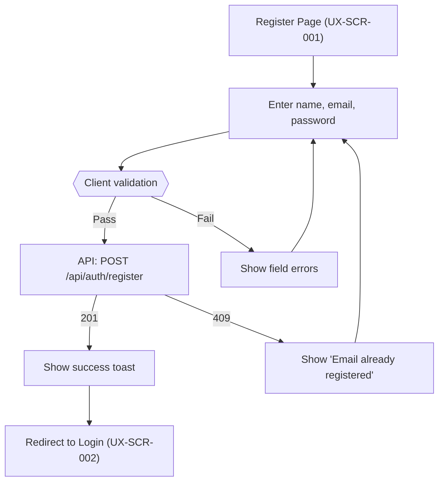
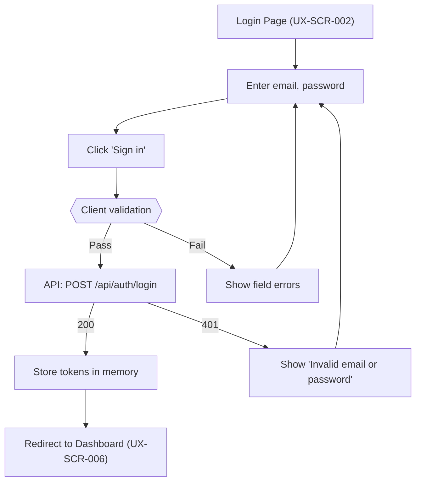
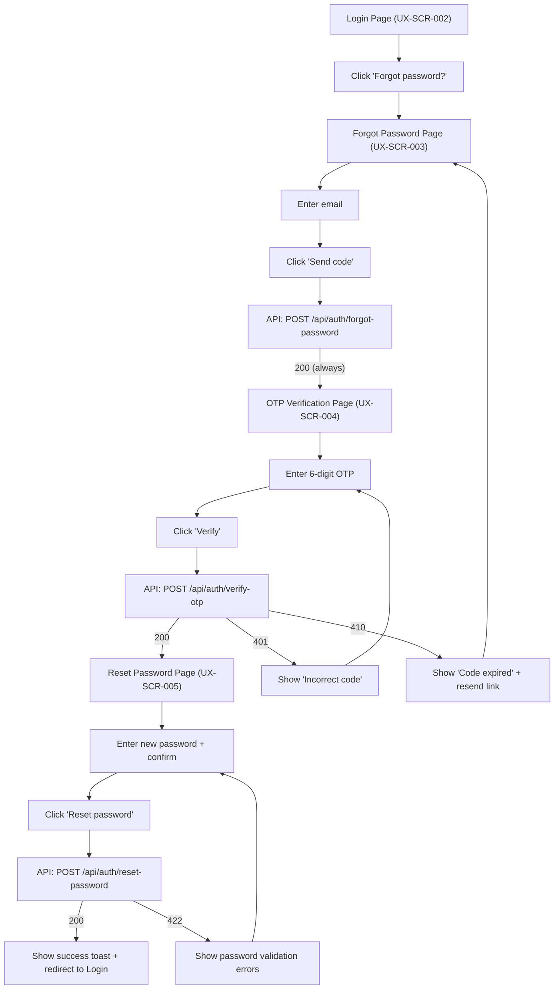
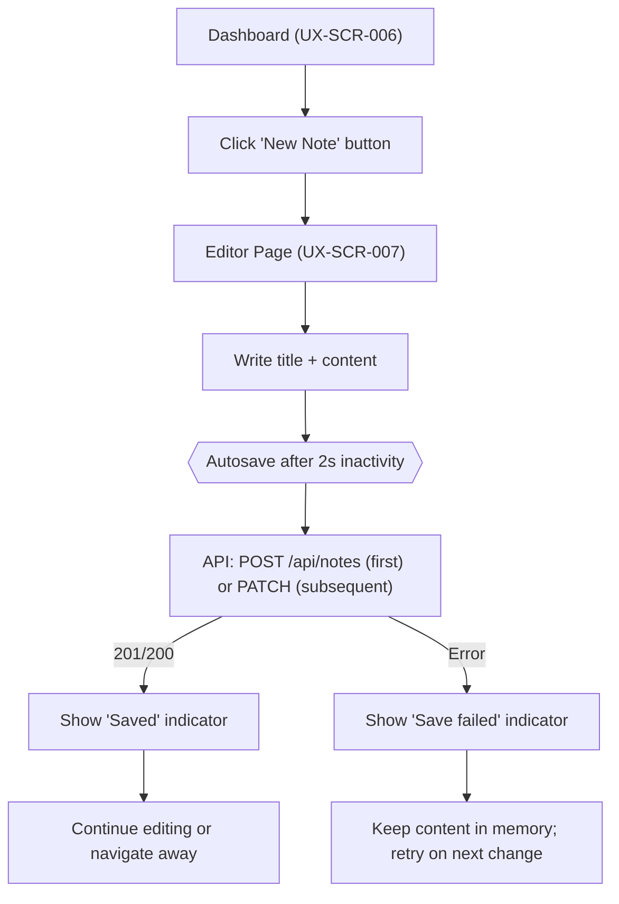
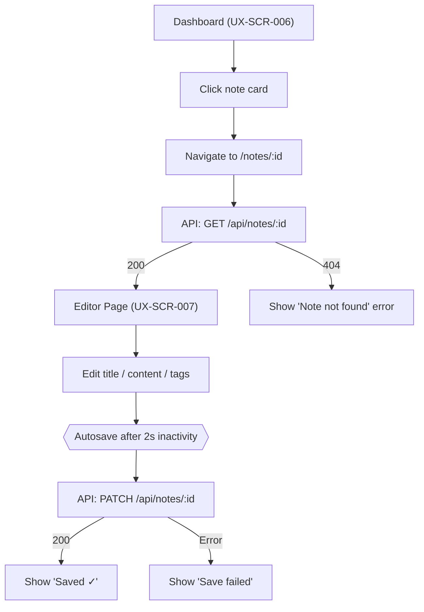
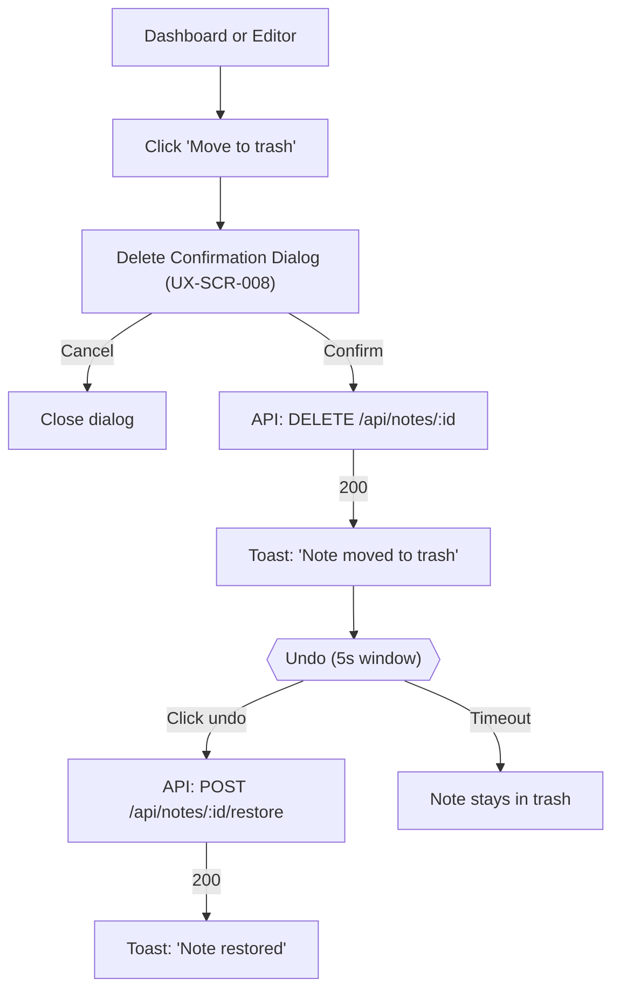
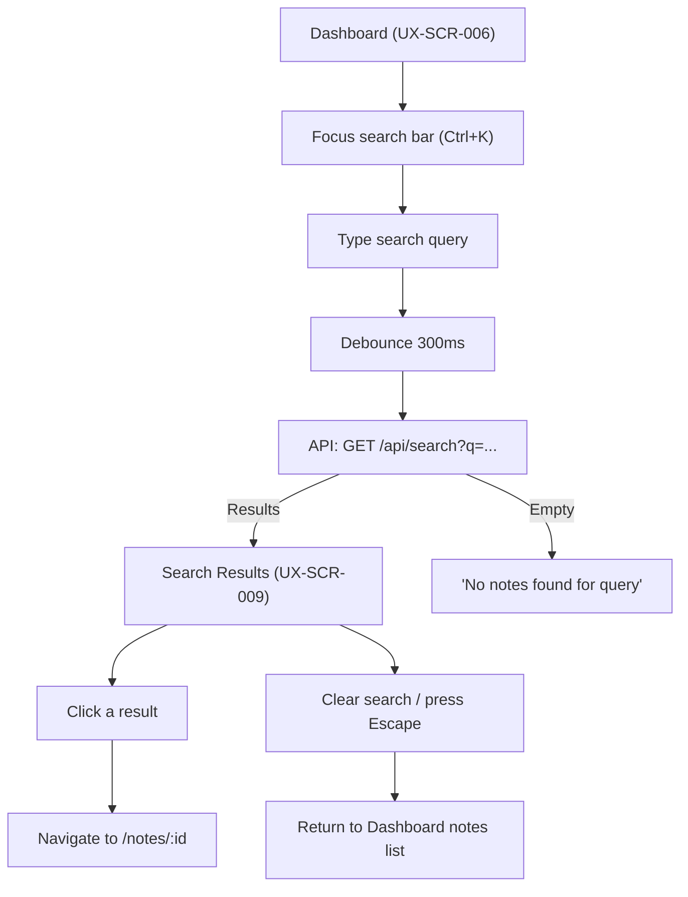
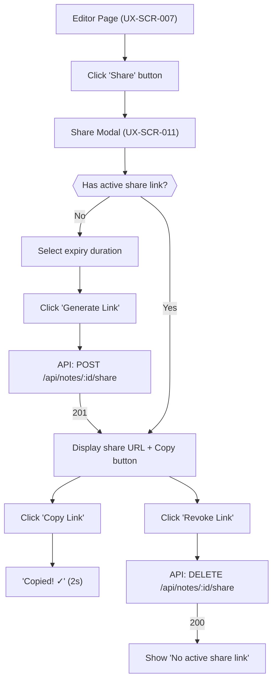
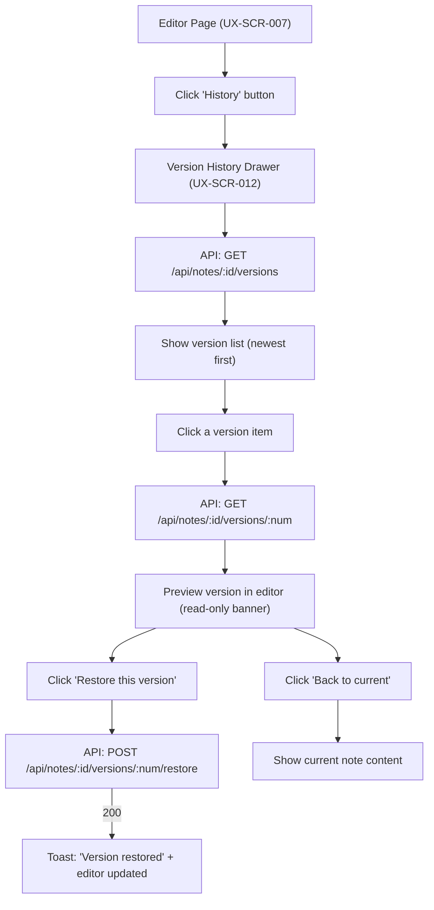

# User Experience Specification (UX)

## Note Taking Application

---

## 1. Document Information

| Field               | Value                                      |
| ------------------- | ------------------------------------------ |
| Document Title      | User Experience Specification              |
| Project Name        | Note Taking Application                    |
| Version             | 1.0.0                                      |
| Status              | Draft                                  |
| Created Date        | 2026-07-21                                 |
| Last Updated        | 2026-07-21                                 |
| Related Documents   | FRS.md, SDS.md                             |

---

## 2. Introduction

This User Experience Specification (UX) defines the visual design system, screen layouts, user navigation flows, interaction patterns, accessibility criteria, and error/empty state behaviors for the Note Taking Application. It bridges the functional requirements in `FRS.md` and the technical implementation specs in `SDS.md` by detailing **how users interact with the system**.

---

## 3. Design Philosophy

1. **Content First**: Clean, distraction-free interface where notes and formatting take center stage.
2. **Speed & Responsiveness**: Immediate visual feedback, optimistic updates, and debounced background autosaving.
3. **Clarity over Complexity**: Predictable navigation patterns, clear status indicators, and human-readable feedback.
4. **Universal Accessibility**: Adherence to WCAG 2.2 AA standards with full keyboard navigation and screen reader support.

---

## 4. User Personas

| Persona | Role | Needs & Goals | Pain Points |
| ------- | ---- | ------------- | ----------- |
| **Alex (Student)** | Daily note taker | Fast note creation, tagging by subject, quick search, history restoration when experimenting. | Slow loading, complicated UI, lost notes. |
| **Sam (Professional)** | Meeting & task logger | Rich-text formatting, task lists, share links with expiry for team reference. | Insecure links, complex share setup, missing formatting. |

---

## 5. Site Map & Navigation Hierarchy



---

## 6. Screen Inventory & Traceability Index

| Screen ID  | Screen Name                   | Route Pattern           | Related Requirements                       | Related APIs                                            |
| ---------- | ----------------------------- | ----------------------- | ------------------------------------------ | ------------------------------------------------------- |
| UX-SCR-001 | Register                      | `/register`             | FR-AUTH-001                                | `POST /api/auth/register`                               |
| UX-SCR-002 | Login                         | `/login`                | FR-AUTH-002                                | `POST /api/auth/login`                                  |
| UX-SCR-003 | Forgot Password               | `/forgot-password`      | FR-PWD-001                                 | `POST /api/auth/forgot-password`                        |
| UX-SCR-004 | OTP Verification              | `/verify-otp`           | FR-PWD-002                                 | `POST /api/auth/verify-otp`                             |
| UX-SCR-005 | Reset Password                | `/reset-password`       | FR-PWD-003                                 | `POST /api/auth/reset-password`                         |
| UX-SCR-006 | Dashboard / Notes List        | `/`                     | FR-NOTE-006, FR-TAG-002                    | `GET /api/notes`, `GET /api/tags`                       |
| UX-SCR-007 | Note Editor (Create / Edit)   | `/notes/new`, `/notes/:id` | FR-NOTE-001 – FR-NOTE-004, FR-TAG-001     | `POST /api/notes`, `GET /api/notes/:id`, `PATCH /api/notes/:id` |
| UX-SCR-008 | Delete Confirmation Dialog    | Modal Overlay           | FR-NOTE-004                                | `DELETE /api/notes/:id`                                 |
| UX-SCR-009 | Search Results                | `/search`               | FR-SRCH-001                                | `GET /api/search`                                       |
| UX-SCR-010 | Tag Management Modal          | Modal Overlay           | FR-TAG-001, FR-TAG-003, FR-TAG-004         | `POST /api/tags`, `PATCH /api/tags/:id`, `DELETE /api/tags/:id` |
| UX-SCR-011 | Share Modal                   | Modal Overlay           | FR-SHARE-001, FR-SHARE-003, FR-SHARE-004   | `POST /api/notes/:id/share`, `DELETE /api/notes/:id/share`, `GET /api/shares` |
| UX-SCR-012 | Version History Drawer        | Slide-Over Drawer       | FR-VER-001 – FR-VER-004                    | `GET /api/notes/:id/versions`, `GET /api/notes/:id/versions/:num`, `POST /api/notes/:id/versions/:num/restore` |
| UX-SCR-013 | Shared Note View (Public)     | `/shared/:token`        | FR-SHARE-002                               | `GET /api/shared/:token`                                |

---

## 7. User Flows

### 7.1 User Registration Flow (FR-AUTH-001)



### 7.2 Login Flow (FR-AUTH-002)



### 7.3 Forgot Password / OTP / Reset Flow (FR-PWD-001, FR-PWD-002, FR-PWD-003)



### 7.4 Create Note Flow (FR-NOTE-001)



### 7.5 Edit Note Flow (FR-NOTE-002, FR-NOTE-003)



### 7.6 Delete Note Flow (FR-NOTE-004)



### 7.7 Search Flow (FR-SRCH-001)



### 7.8 Share Note Flow (FR-SHARE-001, FR-SHARE-003)



### 7.9 Version History Flow (FR-VER-002, FR-VER-003, FR-VER-004)



---

## 8. Screen-by-Screen Specifications

### 8.1 Screen UX-SCR-001: Register

- **Purpose**: Allows new users to create an account.
- **Related Requirements**: FR-AUTH-001
- **Related APIs**: `POST /api/auth/register`
- **Components**: `RegisterPage`, `RegisterForm`, `Input`, `Button`, `PasswordChecklist`
- **User Actions**: Enter full name, email, password; toggle password visibility; click "Create account".
- **Validation Rules**: Name (1–100 chars), Email (valid format), Password (min 8 chars, 1 uppercase, 1 lowercase, 1 digit, 1 special char).
- **Error States**: Field errors under input; banner for `EMAIL_ALREADY_EXISTS` (409).
- **Loading States**: Button shows spinner and text "Creating account...", inputs disabled.
- **Success States**: Toast "Account created! Please sign in.", redirects to `/login`.
- **Empty States**: N/A
- **Navigation**: Link to `/login` ("Already have an account? Sign in").
- **Accessibility Notes**: Labels attached to all inputs; checklist updates live with `aria-live="polite"`.
- **Keyboard Navigation**: `Tab` / `Shift+Tab` cycles through fields; `Enter` submits form.
- **Responsive Behavior**:
  - **Desktop**: Centered card (max 420px).
  - **Tablet/Mobile**: Centered card with 16px side padding.

---

### 8.2 Screen UX-SCR-002: Login

- **Purpose**: Authenticates existing users.
- **Related Requirements**: FR-AUTH-002, FR-AUTH-004
- **Related APIs**: `POST /api/auth/login`
- **Components**: `LoginPage`, `LoginForm`, `Input`, `Button`
- **User Actions**: Enter email, password; click "Sign in"; click "Forgot password?".
- **Validation Rules**: Email and password required.
- **Error States**: Generic banner "Invalid email or password" (401).
- **Loading States**: Button shows spinner + "Signing in...".
- **Success States**: Direct redirect to Dashboard (`/`).
- **Empty States**: N/A
- **Navigation**: Links to `/register` and `/forgot-password`.
- **Accessibility Notes**: Error banner announced via `aria-live="assertive"`.
- **Keyboard Navigation**: Standard tab order, `Enter` submits.
- **Responsive Behavior**: Centered card (max 420px).

---

### 8.3 Screen UX-SCR-003: Forgot Password

- **Purpose**: Initiates password recovery via OTP.
- **Related Requirements**: FR-PWD-001
- **Related APIs**: `POST /api/auth/forgot-password`
- **Components**: `ForgotPasswordPage`, `ForgotPasswordForm`, `Input`, `Button`
- **User Actions**: Enter registered email; click "Send code".
- **Validation Rules**: Valid email format required.
- **Error States**: Field error for invalid email format; 429 toast for rate limit exceeded.
- **Loading States**: Button shows spinner + "Sending...".
- **Success States**: Always navigates to `/verify-otp` (prevents email enumeration).
- **Empty States**: N/A
- **Navigation**: Link back to `/login`.
- **Accessibility Notes**: Clear instructions and notice about console email simulation.
- **Keyboard Navigation**: `Tab` navigation, `Enter` submits.
- **Responsive Behavior**: Centered card (max 420px).

---

### 8.4 Screen UX-SCR-004: OTP Verification

- **Purpose**: Verifies 6-digit OTP code.
- **Related Requirements**: FR-PWD-002
- **Related APIs**: `POST /api/auth/verify-otp`
- **Components**: `VerifyOtpPage`, `OtpInput` (6 digit slots), `CountdownTimer`, `Button`
- **User Actions**: Type or paste 6-digit OTP; click "Verify"; click "Resend code" (when enabled).
- **Validation Rules**: Exactly 6 numeric digits required.
- **Error States**: Shake animation on input boxes + text "Incorrect code. X attempts remaining." (401). Expired notice (410).
- **Loading States**: Verification spinner on last digit entry or button click.
- **Success States**: Direct navigation to `/reset-password` with reset token stored in transient state.
- **Empty States**: N/A
- **Navigation**: Link back to `/forgot-password`.
- **Accessibility Notes**: `aria-label="Digit X of 6"` on individual digit inputs; timer announced politely.
- **Keyboard Navigation**: Digit entry auto-advances focus; `Backspace` moves to previous input.
- **Responsive Behavior**: Centered card (max 420px).

---

### 8.5 Screen UX-SCR-005: Reset Password

- **Purpose**: Sets a new password using a verified reset token.
- **Related Requirements**: FR-PWD-003
- **Related APIs**: `POST /api/auth/reset-password`
- **Components**: `ResetPasswordPage`, `ResetPasswordForm`, `Input`, `PasswordChecklist`, `Button`
- **User Actions**: Enter new password and confirm password; click "Reset password".
- **Validation Rules**: Same complexity rules as registration; must match confirm field; must differ from current password.
- **Error States**: Field error "Passwords do not match"; banner for `PASSWORD_SAME_AS_CURRENT` or `RESET_TOKEN_EXPIRED`.
- **Loading States**: Button shows spinner + "Resetting...".
- **Success States**: Toast "Password reset successful! Please sign in.", redirects to `/login`.
- **Empty States**: N/A
- **Navigation**: N/A
- **Accessibility Notes**: Live feedback on password rules via `aria-live`.
- **Keyboard Navigation**: Standard tab order, `Enter` submits.
- **Responsive Behavior**: Centered card (max 420px).

---

### 8.6 Screen UX-SCR-006: Dashboard / Notes List

- **Purpose**: Main workspace listing notes, tag sidebar, search bar, and navigation.
- **Related Requirements**: FR-NOTE-006, FR-TAG-002
- **Related APIs**: `GET /api/notes`, `GET /api/tags`
- **Components**: `Sidebar`, `NotesList`, `NoteCard`, `TagList`, `SortDropdown`, `PaginationControls`, `UserMenu`
- **User Actions**: Click "+ New Note", select/toggle tags to filter, change sort order, click note to view/edit, page through list, toggle trash view.
- **Validation Rules**: Pagination params within valid bounds.
- **Error States**: Retry banner if note list or tag fetch fails.
- **Loading States**: 3–5 shimmer skeleton cards in list view; tag list shimmer lines.
- **Success States**: Rendered list of notes with title, plain text preview, tags, updated date.
- **Empty States**: Notepad icon + "No notes yet" + "Create your first note to get started" CTA button.
- **Navigation**: Click note row → `/notes/:id`; click "+ New Note" → `/notes/new`.
- **Accessibility Notes**: Skip link to main content (`#main-content`); main landmarks (`<nav>`, `<main>`).
- **Keyboard Navigation**: `Ctrl+N` creates note; `Ctrl+K` focuses search; arrow keys navigate list items.
- **Responsive Behavior**:
  - **Desktop (≥1024px)**: 280px persistent sidebar + main content area.
  - **Tablet (768–1023px)**: Collapsible sidebar overlay (hamburger trigger).
  - **Mobile (<768px)**: Full screen overlay sidebar; single-column list cards.

---

### 8.7 Screen UX-SCR-007: Note Editor (Create / Edit)

- **Purpose**: Rich-text note creation and editing view.
- **Related Requirements**: FR-NOTE-001, FR-NOTE-002, FR-NOTE-003, FR-TAG-001
- **Related APIs**: `POST /api/notes`, `GET /api/notes/:id`, `PATCH /api/notes/:id`
- **Components**: `NoteEditor`, `TipTapToolbar`, `TagBar`, `AutosaveStatusIndicator`, `ActionHeader`
- **User Actions**: Type title; edit content using TipTap toolbar; add/remove tags; click "Share", "History", or "Move to trash".
- **Validation Rules**: Title max 255 chars; content max 500 KB.
- **Error States**: Red indicator "Save failed" if autosave fails; browser `beforeunload` warning if unsaved changes exist.
- **Loading States**: Skeleton title + editor area while fetching existing note. "Saving..." indicator during save.
- **Success States**: "Saved ✓" indicator in top right header.
- **Empty States**: Empty title placeholder "Untitled"; empty body placeholder "Start writing...".
- **Navigation**: Top-left back button `←` returns to Dashboard (`/`).
- **Accessibility Notes**: TipTap toolbar buttons have `aria-label` and active state aria attributes (`aria-pressed`).
- **Keyboard Navigation**: Editor shortcuts: `Ctrl+S` (force save), `Ctrl+B` (bold), `Ctrl+I` (italic), `Ctrl+K` (link).
- **Responsive Behavior**:
  - **Desktop**: Full width editor with single-row sticky toolbar.
  - **Tablet/Mobile**: Horizontally scrollable toolbar; full-width input controls.

---

### 8.8 Screen UX-SCR-008: Delete Confirmation Dialog

- **Purpose**: Confirmation modal for moving a note to trash.
- **Related Requirements**: FR-NOTE-004
- **Related APIs**: `DELETE /api/notes/:id`
- **Components**: `Modal`, `Button`
- **User Actions**: Click "Move to trash" or "Cancel".
- **Validation Rules**: N/A
- **Error States**: Toast notification if delete API call fails.
- **Loading States**: Destructive button shows spinner.
- **Success States**: Note removed from list (optimistic); toast "Note moved to trash." with an **Undo** button.
- **Empty States**: N/A
- **Navigation**: Closes modal; if triggered from editor, redirects to `/`.
- **Accessibility Notes**: Focus trapped inside dialog (`role="dialog"`); focus restored to trigger on close; initial focus on "Cancel".
- **Keyboard Navigation**: `Enter` confirms, `Escape` cancels.
- **Responsive Behavior**: Centered modal (400px width) on all devices.

---

### 8.9 Screen UX-SCR-009: Search Results

- **Purpose**: Full-text search result listing with keyword highlighting.
- **Related Requirements**: FR-SRCH-001
- **Related APIs**: `GET /api/search`
- **Components**: `SearchBar`, `SearchResultsList`, `SearchResultItem`, `SnippetHighlight`
- **User Actions**: Type query into search bar; click result item to open note; clear search query.
- **Validation Rules**: Query max 200 characters.
- **Error States**: Inline error message "Search unavailable. Please try again." + Retry button.
- **Loading States**: Shimmer skeleton result cards.
- **Success States**: Matching results listed with yellow `<mark>` highlighted text in snippets.
- **Empty States**: Search icon + "No notes found for '{query}'" + suggestions text.
- **Navigation**: Click result → `/notes/:id`; press `Escape` or clear → return to Dashboard notes list.
- **Accessibility Notes**: Screen reader announces "{N} results found" via `aria-live="polite"`.
- **Keyboard Navigation**: `Ctrl+K` focuses search input; `Down Arrow` moves to first result.
- **Responsive Behavior**: Fluid single-column layout matching Dashboard main content area.

---

### 8.10 Screen UX-SCR-010: Tag Management Modal

- **Purpose**: Modal interface for creating, editing, recoloring, and deleting tags.
- **Related Requirements**: FR-TAG-001, FR-TAG-003, FR-TAG-004
- **Related APIs**: `POST /api/tags`, `PATCH /api/tags/:id`, `DELETE /api/tags/:id`
- **Components**: `Modal`, `TagForm`, `TagItem`, `ColorPicker`, `Button`
- **User Actions**: Create new tag name/color; inline edit existing tag; delete tag; click close.
- **Validation Rules**: Tag name 1–50 chars, unique per user; color 7-character hex code.
- **Error States**: Inline error "A tag with this name already exists."
- **Loading States**: Spinner on inline save/delete button.
- **Success States**: Tag list updates instantly; toast notification "Tag created/updated/deleted."
- **Empty States**: "No tags yet. Create tags to organize your notes."
- **Navigation**: Closes modal returning to caller view.
- **Accessibility Notes**: Dialog role, focus trap active.
- **Keyboard Navigation**: `Tab` cycles through tag list controls; `Escape` closes modal.
- **Responsive Behavior**: Centered modal (max 520px) on desktop/tablet; full-screen sheet on mobile.

---

### 8.11 Screen UX-SCR-011: Share Modal

- **Purpose**: Modal for generating, displaying, copy-pasting, and revoking public share links.
- **Related Requirements**: FR-SHARE-001, FR-SHARE-003, FR-SHARE-004
- **Related APIs**: `POST /api/notes/:id/share`, `DELETE /api/notes/:id/share`, `GET /api/shares`
- **Components**: `Modal`, `ShareLinkDisplay`, `ExpiryDropdown`, `ViewCounterBadge`, `Button`
- **User Actions**: Select expiry duration (1h to 30d); click "Generate Link"; click "Copy Link"; click "Revoke Link".
- **Validation Rules**: Expiry within 1–720 hours.
- **Error States**: Toast "Failed to generate share link."
- **Loading States**: Spinner while generating token.
- **Success States**: Share URL field displayed; "Copy Link" changes to "Copied! ✓" for 2 seconds.
- **Empty States**: "No active share link for this note."
- **Navigation**: Modal overlay.
- **Accessibility Notes**: Copy status announced via `aria-live="polite"`.
- **Keyboard Navigation**: `Escape` closes modal; `Tab` moves between expiry dropdown, Copy, and Revoke.
- **Responsive Behavior**: Centered modal (480px width) on desktop; bottom sheet on mobile.

---

### 8.12 Screen UX-SCR-012: Version History Drawer

- **Purpose**: Slide-over panel for browsing historical note snapshots and restoring past states.
- **Related Requirements**: FR-VER-001, FR-VER-002, FR-VER-003, FR-VER-004
- **Related APIs**: `GET /api/notes/:id/versions`, `GET /api/notes/:id/versions/:num`, `POST /api/notes/:id/versions/:num/restore`
- **Components**: `Drawer`, `VersionList`, `VersionItem`, `VersionPreviewBanner`, `Button`
- **User Actions**: Click version item to preview; click "Restore this version"; close drawer.
- **Validation Rules**: N/A
- **Error States**: Toast "Unable to load version history."
- **Loading States**: Shimmer list inside drawer; preview loading indicator.
- **Success States**: Yellow banner "Viewing version {N} from {date}"; editor content updates upon restore + toast "Version {N} restored."
- **Empty States**: N/A (minimum version 1 always exists).
- **Navigation**: Drawer slides in from right edge over the editor.
- **Accessibility Notes**: `<aside>` landmark with `aria-label="Version history"`; focus trapped inside drawer when open.
- **Keyboard Navigation**: `Escape` closes drawer and returns focus to "History" button.
- **Responsive Behavior**: 400px width slide-over panel on desktop/tablet; full-screen overlay on mobile.

---

### 8.13 Screen UX-SCR-013: Shared Note View (Public)

- **Purpose**: Read-only public view for users visiting a valid note share link.
- **Related Requirements**: FR-SHARE-002
- **Related APIs**: `GET /api/shared/:token`
- **Components**: `PublicLayout`, `HeaderLogo`, `ReadOnlyContent`, `FooterCTA`
- **User Actions**: Read note title, content, author display name; click CTA "Create your account".
- **Validation Rules**: Valid share token.
- **Error States**: Full page 410 screen "This link has expired" or 404 screen "Note not found" with CTA to register.
- **Loading States**: Full-page centered loading spinner.
- **Success States**: Rendered HTML note content with no editing tools, toolbars, tags, or version controls.
- **Empty States**: N/A
- **Navigation**: Links to `/register`.
- **Accessibility Notes**: Semantic article layout (`<article>`), clean document outline.
- **Keyboard Navigation**: Standard page scroll (`PageDown`/`PageUp`/`Space`).
- **Responsive Behavior**: Centered single column container (max 800px width) with 24px padding.

---

## 9. Wireframe Descriptions

### 9.1 Login Page Wireframe

```
┌──────────────────────────────────────┐
│           [App Logo]                 │
│                                      │
│        ┌──────────────────┐          │
│        │  Sign In          │         │
│        │                   │         │
│        │  Email            │         │
│        │  ┌─────────────┐  │         │
│        │  │             │  │         │
│        │  └─────────────┘  │         │
│        │                   │         │
│        │  Password         │         │
│        │  ┌─────────────┐  │         │
│        │  │          👁  │  │         │
│        │  └─────────────┘  │         │
│        │                   │         │
│        │  [Forgot password?]│        │
│        │                   │         │
│        │  ┌─────────────┐  │         │
│        │  │   Sign In    │  │        │
│        │  └─────────────┘  │         │
│        │                   │         │
│        │  Don't have an    │         │
│        │  account? Sign up │         │
│        └──────────────────┘          │
└──────────────────────────────────────┘
```

### 9.2 Dashboard Wireframe

```
┌─────────────────────────────────────────────────┐
│  [Logo]            🔍 Search...      [User ▼]   │
├───────────┬─────────────────────────────────────┤
│           │  All Notes (24)    [Sort ▼] [+ New] │
│  Tags     │─────────────────────────────────────│
│  ─────    │  ┌─────────────────────────────┐    │
│  📌 All   │  │ Note Title                   │   │
│  #work (5)│  │ Preview text snippet...       │   │
│  #ideas(3)│  │ #work  Updated 2h ago        │   │
│  #tasks(8)│  └─────────────────────────────┘    │
│           │  ┌─────────────────────────────┐    │
│  [Manage] │  │ Another Note                 │   │
│           │  │ Another preview text...       │   │
│  ─────    │  │ #ideas  Updated 1d ago       │   │
│  🗑 Trash │  └─────────────────────────────┘    │
│           │                                     │
│           │  [< 1 2 3 ... 8 >]                  │
├───────────┴─────────────────────────────────────┤
│                                                  │
└──────────────────────────────────────────────────┘
```

### 9.3 Note Editor Wireframe

```
┌──────────────────────────────────────────────────┐
│  ← Back      Saved ✓        [Share][History][⋮] │
├──────────────────────────────────────────────────┤
│  B  I  U  S  H1 H2  •  1.  ""  </>  🔗  ☐      │
├──────────────────────────────────────────────────┤
│                                                   │
│  Note Title                                       │
│  ─────────────────────────────────────            │
│                                                   │
│  Start writing...                                 │
│                                                   │
│                                                   │
│                                                   │
│                                                   │
├──────────────────────────────────────────────────┤
│  Tags: [#work ×] [#ideas ×] [+ Add tag]          │
└──────────────────────────────────────────────────┘
```

---

## 10. Empty States

| Screen / Context                   | Icon     | Primary Message                            | Secondary Message / Action                          |
| ---------------------------------- | -------- | ------------------------------------------ | --------------------------------------------------- |
| Notes list (no notes)              | 📝       | No notes yet                               | "Create your first note to get started" + CTA       |
| Notes list (tag filter, no match)  | 🏷️       | No notes with this tag                     | "Try selecting a different tag"                     |
| Search results (no match)          | 🔍       | No notes found for "{query}"               | "Try different keywords or check spelling"          |
| Trash view (empty)                 | 🗑️       | Trash is empty                             | "Deleted notes appear here for 30 days"             |
| Tags list (no tags)                | 🏷️       | No tags yet                                | "Create tags to organize your notes"                |
| Version history (impossible state) | —        | —                                          | Always has at least version 1                       |
| Share modal (no active link)       | 🔗       | No active share link                       | "Generate a link to share this note publicly"       |

---

## 11. Loading States

| Component / View            | Loading Behavior                                                    |
| --------------------------- | ------------------------------------------------------------------- |
| Notes list                  | 3–5 shimmer skeleton cards matching note card dimensions            |
| Note editor (initial load)  | Skeleton title bar + skeleton body block                            |
| Tag sidebar                 | 4–6 shimmer lines with tag chip shapes                              |
| Search results              | 3 shimmer skeleton cards                                            |
| Version history drawer      | 5 shimmer list items inside drawer                                  |
| Share modal                 | Spinner inside "Generate Link" button                               |
| Auth forms                  | Button text replaced with spinner + action text ("Signing in...")   |
| Shared note view            | Full-page centered spinner with app logo                            |

**Skeleton Pattern Rules:**
- Skeletons use `var(--surface)` background with subtle pulse animation.
- Skeleton dimensions SHALL match the actual content dimensions to prevent layout shift.
- Skeleton animation duration: 1.5 seconds (linear pulse).

---

## 12. Error States

### 12.1 Form Errors (Field-Level)

| Scenario                   | Display Location                        | Style                                |
| -------------------------- | --------------------------------------- | ------------------------------------ |
| Validation failure         | Below the failing input field           | Red text, red border on input        |
| API 422 response           | Map field errors from `details[]` array | Red text below mapped fields         |

### 12.2 Page-Level Errors

| Scenario                   | Display                                 | Action                               |
| -------------------------- | --------------------------------------- | ------------------------------------ |
| API 401 (unauthorized)     | Redirect to login                       | Clear auth state                     |
| API 404 (resource)         | Full page "Not Found" illustration      | "Back to Dashboard" button           |
| API 410 (gone)             | Full page "Expired" illustration        | Context-specific CTA                 |
| API 500 (server error)     | Full page "Something went wrong"        | "Try Again" button                   |
| Network error              | Toast "Connection lost. Retrying..."    | Auto-retry with backoff              |

### 12.3 Inline Errors

| Scenario                   | Display                                 | Recovery                             |
| -------------------------- | --------------------------------------- | ------------------------------------ |
| Autosave failed            | Red "Save failed" indicator in header   | Auto-retry on next change            |
| Search unavailable         | Inline error card in search results     | "Retry" button                       |
| Tag operation failed       | Toast notification                      | Dismiss or retry                     |

---

## 13. Success Messages

All success messages SHALL be displayed as toast notifications.

| Trigger                    | Toast Message                           | Duration | Action                        |
| -------------------------- | --------------------------------------- | -------- | ----------------------------- |
| Account created            | "Account created! Please sign in."      | 5s       | Auto-dismiss                  |
| Login successful           | (No toast — redirect is feedback)       | —        | —                             |
| Password reset successful  | "Password reset successful!"            | 5s       | Auto-dismiss                  |
| OTP sent                   | (No toast — page transition is feedback)| —        | —                             |
| Note created               | (No toast — "Saved ✓" indicator)        | —        | —                             |
| Note updated               | (No toast — "Saved ✓" indicator)        | —        | —                             |
| Note moved to trash        | "Note moved to trash"                   | 5s       | "Undo" button                 |
| Note restored              | "Note restored"                         | 4s       | Auto-dismiss                  |
| Tag created                | "Tag created"                           | 3s       | Auto-dismiss                  |
| Tag updated                | "Tag updated"                           | 3s       | Auto-dismiss                  |
| Tag deleted                | "Tag deleted"                           | 3s       | Auto-dismiss                  |
| Share link generated       | (No toast — link displayed in modal)    | —        | —                             |
| Share link copied          | "Copied! ✓" (inline button feedback)    | 2s       | Revert to "Copy Link"         |
| Share link revoked         | "Share link revoked"                    | 3s       | Auto-dismiss                  |
| Version restored           | "Version {N} restored"                  | 4s       | Auto-dismiss                  |
| Logout successful          | (No toast — redirect is feedback)       | —        | —                             |

---

## 14. Validation Messages

### 14.1 Registration Form

| Field     | Validation Rule                                           | Error Message                                        |
| --------- | --------------------------------------------------------- | ---------------------------------------------------- |
| Name      | Required                                                  | "Full name is required"                              |
| Name      | Max 100 characters                                        | "Name must be 100 characters or less"                |
| Email     | Required                                                  | "Email is required"                                  |
| Email     | Valid email format                                        | "Please enter a valid email address"                 |
| Password  | Required                                                  | "Password is required"                               |
| Password  | Min 8 characters                                          | "Password must be at least 8 characters"             |
| Password  | 1 uppercase letter                                        | "Must contain at least one uppercase letter"         |
| Password  | 1 lowercase letter                                        | "Must contain at least one lowercase letter"         |
| Password  | 1 digit                                                   | "Must contain at least one number"                   |
| Password  | 1 special character                                       | "Must contain at least one special character (!@#$%^&*)" |

### 14.2 Login Form

| Field     | Validation Rule                                           | Error Message                                        |
| --------- | --------------------------------------------------------- | ---------------------------------------------------- |
| Email     | Required                                                  | "Email is required"                                  |
| Email     | Valid email format                                        | "Please enter a valid email address"                 |
| Password  | Required                                                  | "Password is required"                               |

### 14.3 Note Editor

| Field     | Validation Rule                                           | Error Message                                        |
| --------- | --------------------------------------------------------- | ---------------------------------------------------- |
| Title     | Max 255 characters                                        | "Title must be 255 characters or less"               |
| Content   | Max 500 KB                                                | "Note content exceeds the maximum allowed size"      |

### 14.4 Tag Form

| Field     | Validation Rule                                           | Error Message                                        |
| --------- | --------------------------------------------------------- | ---------------------------------------------------- |
| Name      | Required                                                  | "Tag name is required"                               |
| Name      | Max 50 characters                                         | "Tag name must be 50 characters or less"             |
| Name      | Unique per user                                           | "A tag with this name already exists"                |
| Color     | Valid hex format (#RRGGBB)                                | "Please enter a valid color (e.g., #FF5733)"         |

### 14.5 Search

| Field     | Validation Rule                                           | Error Message                                        |
| --------- | --------------------------------------------------------- | ---------------------------------------------------- |
| Query     | Required (min 1 character)                                | "Enter a search term"                                |
| Query     | Max 200 characters                                        | "Search query is too long (max 200 characters)"      |

### 14.6 Share Modal

| Field     | Validation Rule                                           | Error Message                                        |
| --------- | --------------------------------------------------------- | ---------------------------------------------------- |
| Expiry    | Between 1 hour and 30 days                                | "Expiry must be between 1 hour and 30 days"          |

### 14.7 Password Reset

| Field         | Validation Rule                                       | Error Message                                        |
| ------------- | ----------------------------------------------------- | ---------------------------------------------------- |
| New Password  | Same rules as registration password                   | Same messages as registration                        |
| Confirm       | Must match "New Password"                             | "Passwords do not match"                             |
| OTP           | Exactly 6 digits                                      | "Please enter all 6 digits"                          |

---

## 15. Keyboard Accessibility

### 15.1 Global Shortcuts

| Shortcut    | Action                                      | Context                |
| ----------- | ------------------------------------------- | ---------------------- |
| `Ctrl+K`    | Focus search bar                            | Dashboard              |
| `Ctrl+N`    | Create new note                             | Dashboard              |
| `Escape`    | Close modal / drawer / clear search         | Any open overlay       |

### 15.2 Editor Shortcuts

| Shortcut        | Action                              |
| --------------- | ----------------------------------- |
| `Ctrl+S`        | Force save (override autosave)      |
| `Ctrl+B`        | Bold                                |
| `Ctrl+I`        | Italic                              |
| `Ctrl+U`        | Underline                           |
| `Ctrl+Shift+X`  | Strikethrough                       |
| `Ctrl+Shift+H`  | Highlight                           |
| `Ctrl+K`        | Insert/edit link                    |
| `Ctrl+Shift+8`  | Bullet list                        |
| `Ctrl+Shift+9`  | Ordered list                       |
| `Ctrl+Shift+B`  | Blockquote                         |
| `Ctrl+E`        | Code (inline)                       |
| `Ctrl+Shift+E`  | Code block                         |

### 15.3 Notes List Shortcuts

| Shortcut        | Action                              |
| --------------- | ----------------------------------- |
| `↑` / `↓`      | Navigate note list items            |
| `Enter`         | Open selected note                  |
| `Delete`        | Prompt delete for selected note     |

### 15.4 Focus Management Rules

1. Opening a modal → focus moves to first interactive element inside the modal.
2. Closing a modal → focus returns to the element that triggered the modal.
3. Opening a drawer → focus moves to the first interactive element in the drawer.
4. Closing a drawer → focus returns to the button that opened the drawer.
5. Page navigation → focus moves to the page heading (`<h1>`) or main content.
6. Toast notifications → do NOT steal focus; use `aria-live` for screen reader announcement.

---

## 16. Responsive Behavior

### 16.1 Breakpoints

| Name    | Min Width | Max Width | Sidebar Behavior     | Layout                    |
| ------- | --------- | --------- | -------------------- | ------------------------- |
| Mobile  | 320px     | 767px     | Hidden (overlay)     | Single column             |
| Tablet  | 768px     | 1023px    | Collapsible overlay  | Single column + overlay   |
| Desktop | 1024px    | —         | Persistent (280px)   | Sidebar + content         |

### 16.2 Component Adaptations

| Component              | Desktop                     | Tablet                         | Mobile                         |
| ---------------------- | --------------------------- | ------------------------------ | ------------------------------ |
| Sidebar                | Persistent 280px            | Hamburger → overlay            | Hamburger → full-screen overlay|
| Notes list             | Multi-column if wide        | Single column                  | Single column, smaller cards   |
| Note editor toolbar    | Single row, sticky          | Single row, sticky             | Horizontally scrollable        |
| Modals                 | Centered (max-width card)   | Centered (max-width card)      | Bottom sheet (full width)      |
| Version history drawer | 400px slide-over            | 400px slide-over               | Full-screen overlay            |
| Pagination             | Full controls               | Full controls                  | Simplified (prev/next only)    |

### 16.3 Touch Considerations

- Touch targets: minimum 44×44px (WCAG 2.5.5).
- Swipe gestures: Not used (avoid conflicting with browser gestures).
- Long press: Not used (rely on explicit action buttons).

---

## 17. Accessibility Guidelines (WCAG 2.2 AA Compliance)

The application MUST strictly satisfy WCAG 2.2 Level AA guidelines:

| Guideline | WCAG SC | Implementation Mechanics |
| --------- | ------- | ------------------------ |
| **Non-text Content** | 1.1.1 | All icons have `aria-label` or `aria-hidden="true"` when decorative. |
| **Contrast (Minimum)** | 1.4.3 | Text contrast ≥ 4.5:1 (normal text) and ≥ 3:1 (large text / icons). |
| **Keyboard Operability**| 2.1.1 | 100% of interactive controls reachable and operable via keyboard. |
| **No Keyboard Trap** | 2.1.2 | Focus is trapped inside open modals/drawers, but released cleanly on close/Escape. |
| **Focus Visible** | 2.4.7 | Distinct 2px high-contrast ring focus indicator on active elements. |
| **Focus Not Obscured** | 2.4.11 | Sticky elements (editor toolbar) do not obscure focused form fields. |
| **Focus Appearance** | 2.4.13 | Focus indicators have a minimum 2px thickness and 3:1 contrast ratio. |
| **Consistent Help** | 3.2.6 | Help, search, and navigation controls occur in consistent visual positions. |
| **Redundant Entry** | 3.3.7 | Previously entered info (e.g. email in password reset) is auto-populated. |
| **Accessible Auth** | 3.3.8 | OTP & login support password managers and paste without blocking. |

---

## 18. Microinteractions & Animations

| Interaction              | Animation                                      | Duration              | Easing                          |
| ------------------------ | ---------------------------------------------- | --------------------- | ------------------------------- |
| Button hover             | Background color transition                    | 150ms                 | `ease-in-out`                   |
| Button press             | Scale to 0.97                                  | 100ms                 | `ease-out`                      |
| Tag chip add             | Scale from 0.8 → 1.0 + fade in                | 200ms                 | `cubic-bezier(0.4, 0, 0.2, 1)` |
| Tag chip remove          | Scale to 0.8 + fade out                        | 150ms                 | `ease-in`                       |
| Note card delete (trash) | Slide left + fade out                          | 250ms                 | `ease-in`                       |
| Drawer open              | Slide in from right (translateX 100% → 0)      | 300ms                 | `cubic-bezier(0.4, 0, 0.2, 1)` |
| Drawer close             | Slide out to right (translateX 0 → 100%)       | 250ms                 | `ease-in`                       |
| Modal open               | Fade in + scale from 0.95                      | 200ms                 | `cubic-bezier(0.4, 0, 0.2, 1)` |
| Modal close              | Fade out + scale to 0.95                       | 150ms                 | `ease-in`                       |
| Modal backdrop            | Fade in (0 → 0.5 opacity)                     | 200ms                 | `ease-out`                      |
| Toast enter              | Slide down from top + fade in                  | 300ms                 | `cubic-bezier(0.4, 0, 0.2, 1)` |
| Toast exit               | Slide up + fade out                            | 200ms                 | `ease-in`                       |
| OTP digit input (error)  | Shake animation (translateX ±4px)              | 400ms                 | `ease-in-out`                   |
| Password strength meter  | Width transition (smooth bar fill)             | 300ms                 | `ease-out`                      |
| Skeleton pulse           | Opacity 0.4 → 1.0 → 0.4 (infinite)            | 1500ms                | `linear`                        |
| Page transition          | Fade in from opacity 0                         | 200ms                 | `ease-out`                      |
| Autosave indicator       | "Saving..." → "Saved ✓" with check icon fade  | 200ms (icon)          | `ease-out`                      |

---

## 19. Toast Notification Design

### 19.1 Toast Component Specifications

| Property          | Value                                          |
| ----------------- | ---------------------------------------------- |
| Position          | Top-right corner, 16px from edges              |
| Width             | 360px (desktop), full width minus 32px (mobile)|
| Max visible       | 3 toasts stacked; older dismissed first        |
| Default duration  | Varies by type (see Section 13)                |
| Z-index           | `var(--z-toast)` = 60                          |

### 19.2 Toast Variants

| Variant     | Icon  | Border Color             | Usage                              |
| ----------- | ----- | ------------------------ | ---------------------------------- |
| Success     | ✓     | `var(--success)`         | Successful operations              |
| Error       | ✕     | `var(--destructive)`     | Failed operations                  |
| Warning     | ⚠     | `var(--warning)`         | Rate limits, deprecations          |
| Info        | ℹ     | `var(--primary)`         | Informational messages             |

### 19.3 Toast with Action

Some toasts include an actionable button (e.g., "Undo" on delete). The action button is right-aligned within the toast. Clicking the action dismisses the toast and triggers the action.

---

## 20. Modal Behavior

### 20.1 General Modal Rules

1. Modals open centered on the viewport with a semi-transparent backdrop (opacity 0.5).
2. Clicking the backdrop closes the modal.
3. Pressing `Escape` closes the modal.
4. Focus is trapped inside the modal while open.
5. On close, focus returns to the element that triggered the modal.
6. Body scroll is disabled while modal is open.
7. Modals have `role="dialog"` and `aria-modal="true"`.
8. Modals have a descriptive `aria-labelledby` pointing to the modal title.

### 20.2 Confirmation Dialog Rules

For destructive actions (delete note):

1. Default focus is on the "Cancel" button (not the destructive action).
2. The destructive button uses `var(--destructive)` color.
3. The dialog clearly states the consequence of the action.
4. The dialog identifies the resource being acted upon (e.g., note title).

---

## 21. Design System & Style Tokens

### 21.1 Color Tokens

| Token | Light Value | Dark Value | Usage |
| ----- | ----------- | ---------- | ----- |
| `--primary` | `#2563EB` | `#3B82F6` | Primary action buttons, active links, focus rings |
| `--primary-hover`| `#1D4ED8` | `#2563EB` | Hover state for primary buttons |
| `--background` | `#FFFFFF` | `#0F172A` | Primary window background |
| `--surface` | `#F8FAFC` | `#1E293B` | Card surfaces, sidebar background, modals |
| `--border` | `#E2E8F0` | `#334155` | Structural borders, card outlines |
| `--text-primary` | `#0F172A` | `#F8FAFC` | High-contrast body text and headers |
| `--text-secondary`| `#64748B` | `#94A3B8` | Subtitles, placeholders, timestamps |
| `--destructive` | `#DC2626` | `#EF4444` | Trash buttons, delete confirmations, error banners |
| `--success` | `#16A34A` | `#22C55E` | "Saved ✓" indicator, success toasts |
| `--warning` | `#D97706` | `#F59E0B` | Version preview banner background |

### 21.2 Typography

| Token                  | Font Family           | Size   | Weight | Line Height | Usage                          |
| ---------------------- | --------------------- | ------ | ------ | ----------- | ------------------------------ |
| `--font-heading-1`     | Inter, sans-serif     | 28px   | 700    | 1.3         | Page titles                    |
| `--font-heading-2`     | Inter, sans-serif     | 22px   | 600    | 1.3         | Section headings               |
| `--font-heading-3`     | Inter, sans-serif     | 18px   | 600    | 1.4         | Card titles, modal titles      |
| `--font-body`          | Inter, sans-serif     | 14px   | 400    | 1.6         | Body text, descriptions        |
| `--font-body-sm`       | Inter, sans-serif     | 12px   | 400    | 1.5         | Captions, timestamps, metadata |
| `--font-code`          | JetBrains Mono, monospace | 13px | 400   | 1.6         | Code blocks, inline code       |
| `--font-label`         | Inter, sans-serif     | 13px   | 500    | 1.4         | Form labels, chip text         |

### 21.3 Spacing Scale

| Token    | Value | Usage                                       |
| -------- | ----- | ------------------------------------------- |
| `--sp-1` | 4px   | Tight gaps (icon-text, chip padding)        |
| `--sp-2` | 8px   | Small gaps (between inline elements)        |
| `--sp-3` | 12px  | Form field gaps, small section spacing      |
| `--sp-4` | 16px  | Standard component padding, card padding    |
| `--sp-5` | 20px  | Section gaps within cards                   |
| `--sp-6` | 24px  | Major section spacing, page margins         |
| `--sp-8` | 32px  | Large section breaks                        |
| `--sp-10`| 40px  | Page-level spacing                          |
| `--sp-12`| 48px  | Hero spacing, major layout gaps             |

### 21.4 Border Radius

| Token        | Value | Usage                                        |
| ------------ | ----- | -------------------------------------------- |
| `--radius-sm`| 4px   | Small elements (tags, badges)                |
| `--radius-md`| 8px   | Cards, inputs, buttons                       |
| `--radius-lg`| 12px  | Modals, large cards                          |
| `--radius-xl`| 16px  | Panels, drawers                              |
| `--radius-full`| 9999px | Circular avatars, toggle pills           |

### 21.5 Elevation / Shadows

| Token            | Value                                              | Usage                          |
| ---------------- | -------------------------------------------------- | ------------------------------ |
| `--shadow-sm`    | `0 1px 2px rgba(0,0,0,0.05)`                      | Subtle card elevation          |
| `--shadow-md`    | `0 4px 6px -1px rgba(0,0,0,0.1), 0 2px 4px -2px rgba(0,0,0,0.1)` | Cards, dropdowns |
| `--shadow-lg`    | `0 10px 15px -3px rgba(0,0,0,0.1), 0 4px 6px -4px rgba(0,0,0,0.1)` | Modals, popovers |
| `--shadow-xl`    | `0 20px 25px -5px rgba(0,0,0,0.1), 0 8px 10px -6px rgba(0,0,0,0.1)` | Drawers        |

### 21.6 Default Tag Colors

A preset palette for tags when no custom color is chosen:

| Color Name | Hex Value | Usage                    |
| ---------- | --------- | ------------------------ |
| Gray       | `#6B7280` | Default tag color        |
| Red        | `#EF4444` | Urgent / Priority        |
| Orange     | `#F97316` | Warning / In-progress    |
| Yellow     | `#EAB308` | Review / Pending         |
| Green      | `#22C55E` | Done / Complete          |
| Blue       | `#3B82F6` | Information / Reference  |
| Purple     | `#8B5CF6` | Ideas / Creative         |
| Pink       | `#EC4899` | Personal                 |

### 21.7 Icon Sizes

| Size Token | Dimensions | Usage |
| ---------- | ---------- | ----- |
| `icon-sm` | `16px × 16px` | Inline chip icons, status badges, small button icons |
| `icon-md` | `20px × 20px` | Standard button icons, input prefixes, navigation items |
| `icon-lg` | `24px × 24px` | Header actions, modal close triggers |
| `icon-xl` | `32px × 32px` | Empty state illustrations, alert banners |

### 21.8 Animation & Transition Tokens

| Motion Token | Duration | Easing Curve | Usage |
| ------------ | -------- | ------------ | ----- |
| `--duration-fast` | `100ms` | `cubic-bezier(0, 0, 0.2, 1)` | Button active presses, checkbox toggles |
| `--duration-normal`| `200ms` | `cubic-bezier(0.4, 0, 0.2, 1)` | Dropdown menus, tooltips, border glows |
| `--duration-slow` | `300ms` | `cubic-bezier(0.4, 0, 0.2, 1)` | Modal fade-in, toast slide-in, drawer slide-over |

### 21.9 Z-Index Scale

| Layer Token | Z-Index | Usage |
| ----------- | ------- | ----- |
| `--z-sticky` | `10` | Sticky editor toolbar, header bar |
| `--z-dropdown`| `20` | Dropdown menus, select popovers |
| `--z-drawer` | `40` | Slide-over Version History Drawer (UX-SCR-012) |
| `--z-modal` | `50` | Modals (UX-SCR-008, UX-SCR-010, UX-SCR-011) |
| `--z-toast` | `60` | Toast notifications container |

---

## 22. UX Acceptance Criteria

### 22.1 Authentication UX

| ID          | Criterion                                                                                   |
| ----------- | ------------------------------------------------------------------------------------------- |
| UX-AUTH-01  | Registration form shows real-time password strength checklist with live updates.             |
| UX-AUTH-02  | Login error message is generic ("Invalid email or password") — never reveals which field is wrong. |
| UX-AUTH-03  | Forgot password flow always navigates to OTP page regardless of email existence.            |
| UX-AUTH-04  | OTP input auto-advances focus on digit entry and supports paste.                            |
| UX-AUTH-05  | Password reset form auto-populates the email field from the previous step.                  |
| UX-AUTH-06  | All auth forms disable the submit button during loading and show a spinner.                 |

### 22.2 Notes UX

| ID          | Criterion                                                                                   |
| ----------- | ------------------------------------------------------------------------------------------- |
| UX-NOTE-01  | New note starts with cursor in the title field.                                             |
| UX-NOTE-02  | Autosave triggers after 2 seconds of inactivity with a visible "Saving..." → "Saved ✓" indicator. |
| UX-NOTE-03  | Delete confirmation dialog defaults focus to "Cancel", not "Delete".                        |
| UX-NOTE-04  | Delete toast includes an "Undo" button that restores the note within 5 seconds.             |
| UX-NOTE-05  | Notes list shows a shimmer skeleton during initial load (not a spinner).                    |
| UX-NOTE-06  | Navigating away from editor with unsaved changes triggers browser confirmation.             |
| UX-NOTE-07  | Empty notes list shows an illustration with a CTA to create the first note.                 |

### 22.3 Tags UX

| ID          | Criterion                                                                                   |
| ----------- | ------------------------------------------------------------------------------------------- |
| UX-TAG-01   | Tag chips show the tag color as a left border or background tint.                           |
| UX-TAG-02   | Tag management modal supports inline editing (click tag name to edit).                      |
| UX-TAG-03   | Tag creation in the editor allows creating a new tag without opening the management modal.  |
| UX-TAG-04   | Sidebar tag list shows note count badge next to each tag.                                   |

### 22.4 Search UX

| ID          | Criterion                                                                                   |
| ----------- | ------------------------------------------------------------------------------------------- |
| UX-SRCH-01  | Search input is debounced at 300ms.                                                         |
| UX-SRCH-02  | Search results show highlighted keywords wrapped in `<mark>` tags.                          |
| UX-SRCH-03  | Search results announce count via `aria-live` for screen readers.                           |
| UX-SRCH-04  | Pressing Escape in search clears the query and returns to the notes list.                   |

### 22.5 Sharing UX

| ID          | Criterion                                                                                   |
| ----------- | ------------------------------------------------------------------------------------------- |
| UX-SHARE-01 | Share modal shows view count for active links.                                              |
| UX-SHARE-02 | "Copy Link" button changes to "Copied! ✓" for 2 seconds with visual feedback.              |
| UX-SHARE-03 | Shared note public view does not expose email, tags, version history, or note ID.           |
| UX-SHARE-04 | Expired share link shows a clear expiry message with a CTA to register.                     |

### 22.6 Version History UX

| ID          | Criterion                                                                                   |
| ----------- | ------------------------------------------------------------------------------------------- |
| UX-VER-01   | Version history drawer slides in from the right edge of the screen.                         |
| UX-VER-02   | Previewing a version shows a yellow banner indicating the version number and date.          |
| UX-VER-03   | Restoring a version creates a new version (no data loss warning needed).                    |
| UX-VER-04   | Version list shows version number, date, and first ~50 characters of content as preview.    |

### 22.7 General UX

| ID          | Criterion                                                                                   |
| ----------- | ------------------------------------------------------------------------------------------- |
| UX-GEN-01   | All modals can be closed with Escape key.                                                   |
| UX-GEN-02   | All modals trap focus and restore focus on close.                                           |
| UX-GEN-03   | The application is fully functional at viewport widths ≥320px.                              |
| UX-GEN-04   | Toast notifications stack (max 3) in the top-right corner.                                  |
| UX-GEN-05   | Skeleton loading states match the dimensions of actual content.                             |
| UX-GEN-06   | All interactive elements have visible focus indicators.                                     |
| UX-GEN-07   | Dark mode support follows system preference (prefers-color-scheme).                         |
| UX-GEN-08   | Skip-to-content link is provided on the Dashboard page.                                     |
| UX-GEN-09   | Page transitions use a subtle fade-in animation (200ms).                                    |
| UX-GEN-10   | All timestamps display in the user's local timezone.                                        |

---

*End of User Experience Specification*
